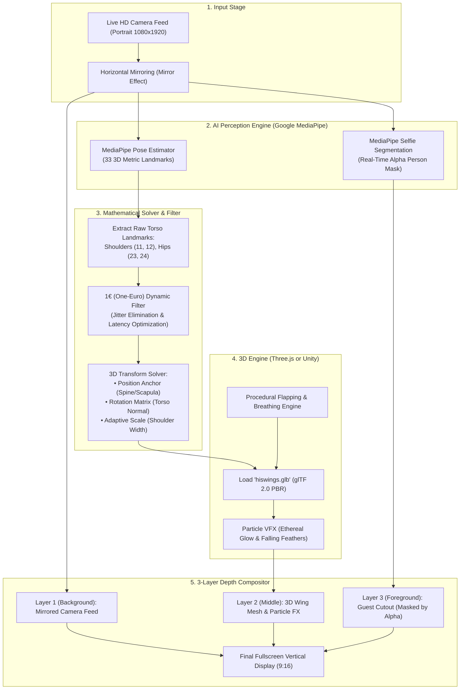

# Interactive AR Angel Wings Kiosk: Technical Architecture & Implementation Blueprint

## 1. Project Overview & Vision

### 1.1 Concept
This project is an interactive, real-time **Augmented Reality (AR) Magic Mirror Kiosk**. When a guest steps in front of a vertical display (9:16 portrait orientation) equipped with a camera, high-fidelity 3D angel wings (`hiswings.glb`) dynamically emerge from behind their shoulder blades. The wings follow the guest's movements in real time—pitching, rolling, turning, and scaling smoothly as the guest walks, turns, or dances in front of the screen.

### 1.2 Core Experience Goals
* **Snapchat / TikTok Filter Quality:** Visual magic where the 3D wings feel physically attached to the guest's body.
* **Flawless Occlusion:** The wings must appear strictly **behind** the guest's back and shoulders, never clipping through their chest or clothing.
* **Buttery-Smooth Motion:** Elimination of camera tracking jitter while maintaining near-zero perceived latency (< 35 ms).
* **Adaptive Scaling:** The wings dynamically adapt to people of varying heights, sizes (adults vs. children), and distances from the camera.
* **Living Motion:** Beyond static attachment, the wings exhibit gentle procedural idle breathing/flapping and can react dynamically to arm gestures.

---

## 2. End-to-End System Architecture

The following diagram illustrates how video frames travel from the physical camera through computer vision, mathematics, 3D rendering, and compositing to the vertical display:



---

## 3. Core Computer Vision & Mathematical Mechanics

### 3.1 3D Skeletal Landmark Extraction
The system captures metric 3D coordinates $(x, y, z)$ from Google MediaPipe Pose:
* $\vec{P}_{\text{LS}} = \text{Left Shoulder (Landmark 11)}$
* $\vec{P}_{\text{RS}} = \text{Right Shoulder (Landmark 12)}$
* $\vec{P}_{\text{LH}} = \text{Left Hip (Landmark 23)}$
* $\vec{P}_{\text{RH}} = \text{Right Hip (Landmark 24)}$

### 3.2 3D Anchor Position Calculation
The wings anchor to the upper thoracic spine (between the shoulder blades):
$$\vec{P}_{\text{shoulder\_center}} = \frac{\vec{P}_{\text{LS}} + \vec{P}_{\text{RS}}}{2}$$
$$\vec{P}_{\text{hip\_center}} = \frac{\vec{P}_{\text{LH}} + \vec{P}_{\text{RH}}}{2}$$

To place the wings naturally behind the shoulder blades, the anchor point is calculated as:
$$\vec{P}_{\text{wing\_anchor}} = \vec{P}_{\text{shoulder\_center}} - k_{\text{spine}} \cdot (\vec{P}_{\text{shoulder\_center}} - \vec{P}_{\text{hip\_center}}) - k_{\text{depth}} \cdot \vec{Z}_{\text{normal}}$$
* $k_{\text{spine}} \approx 0.15$ (positions the root slightly below the neck vertebrae).
* $k_{\text{depth}} \approx 0.08\,\text{m}$ (pushes the wing base slightly behind the back plane).

### 3.3 3D Torso Orientation & Rotation Matrix
When the guest turns their body, leans forward, or bends sideways, the wings must rotate in true 3D space:
1. **Horizontal Tangent ($\vec{X}$ - Right Vector):**
   $$\vec{X} = \frac{\vec{P}_{\text{RS}} - \vec{P}_{\text{LS}}}{\|\vec{P}_{\text{RS}} - \vec{P}_{\text{LS}}\|}$$
2. **Vertical Spine Axis ($\vec{Y}$ - Up Vector):**
   $$\vec{Y} = \frac{\vec{P}_{\text{shoulder\_center}} - \vec{P}_{\text{hip\_center}}}{\|\vec{P}_{\text{shoulder\_center}} - \vec{P}_{\text{hip\_center}}\|}$$
3. **Torso Normal Vector ($\vec{Z}$ - Front/Chest Facing Direction):**
   $$\vec{Z}_{\text{chest}} = \frac{\vec{X} \times \vec{Y}}{\|\vec{X} \times \vec{Y}\|}$$
4. **Re-orthogonalized Up Vector:**
   $$\vec{Y}_{\text{ortho}} = \vec{Z}_{\text{chest}} \times \vec{X}$$

The rotation matrix $R_{\text{torso}} = [\vec{X} \mid \vec{Y}_{\text{ortho}} \mid -\vec{Z}_{\text{chest}}]$ aligns the wings so they project out of the back ($-\vec{Z}$).

### 3.4 Dynamic Adaptive Scaling
The asset `hiswings.glb` has a natural unscaled wingspan of $\sim 4.01\,\text{meters}$.
To automatically fit any guest regardless of body size or distance from the camera:
$$\text{CurrentShoulderSpan} = \|\vec{P}_{\text{RS}} - \vec{P}_{\text{LS}}\|$$
$$\text{ScaleFactor} = \frac{\text{CurrentShoulderSpan}}{\text{ReferenceShoulderSpan}} \times S_{\text{user\_scale}}$$
* If an adult steps closer, the wings scale proportionally.
* If a child steps into frame, the wings adapt automatically to their smaller frame.

### 3.5 Jitter Elimination: The 1€ (One-Euro) Filter
Raw neural network predictions exhibit high-frequency micro-jitter. Traditional exponential smoothing introduces lag and sluggishness during fast motion. 
The **1€ Filter** solves this through an adaptive cutoff frequency $\hat{f}_c$:
$$\hat{f}_c = f_{c,\min} + \beta \cdot |\dot{x}|$$
* **When the guest is still ($|\dot{x}| \approx 0$):** $f_c$ drops to $f_{c,\min}$ (e.g., $1.0\,\text{Hz}$), eliminating all jitter and shaking.
* **When the guest moves quickly ($|\dot{x}| \gg 0$):** $f_c$ increases dynamically based on speed $\beta$ (e.g., $0.007$), reducing lag to zero.

### 3.6 The Occlusion Engine: Placing Wings *Behind* the Guest
In monocular RGB cameras, there is no hardware depth channel. If the 3D wings were simply drawn on top of the webcam feed, they would render directly over the guest's chest.

**The 3-Layer Compositing Solution:**
1. **Layer 1 (Bottom):** The mirrored live camera feed.
2. **Layer 2 (Middle):** The 3D wings mesh (`hiswings.glb`), rendered with perspective projection and dynamic lighting.
3. **Layer 3 (Top):** The guest's body cutout, generated using MediaPipe's real-time **Segmentation Mask** (Alpha channel).
4. **Result:** Because the guest's silhouette is composited on top of the wings, the wings are visibly occluded by the torso and emerge seamlessly from behind the back.

---

## 4. 3D Asset Mechanics (`hiswings.glb`)

### 4.1 Asset Profile
* **Format:** glTF 2.0 Binary (`.glb`)
* **Geometry:** Single indexed triangle mesh (`SKEL_ROOT.002`), 4,786 vertices.
* **Unscaled Dimensions:** $X \approx 4.01\,\text{m}$ (span), $Z \approx 0.97\,\text{m}$ (height), $Y \approx 0.30\,\text{m}$ (thickness).
* **Shading & Textures:** Embedded diffuse map (`head_diff_000_a_whi_1.png`) and specular alpha map (`head_spec_000_0@channels=A.png`). Configured with `alphaMode: BLEND` and `doubleSided: true` for feather transparency.

### 4.2 Procedural Animation Engine
Because the raw `.glb` file is a static mesh without skeletal animation bones, life is injected procedurally in code:
1. **Idle Breathing/Hover Motion:**
   * Apply a continuous smooth sinusoidal oscillation to wing rotation:
     $$\theta_{\text{flap}}(t) = A_{\text{idle}} \cdot \sin(2\pi f_{\text{idle}} t)$$
     where $A_{\text{idle}} \approx 4^\circ\text{--}8^\circ$ and $f_{\text{idle}} \approx 0.6\,\text{Hz}$.
2. **Gesture-Reactive Flapping:**
   * Track wrist landmarks (`LEFT_WRIST`, `RIGHT_WRIST`) relative to shoulders.
   * When the guest raises and lowers their arms, compute vertical wrist velocity $v_y$.
   * Dynamically modulate the flapping amplitude $A$:
     $$A = A_{\text{idle}} + k_{\text{gesture}} \cdot |v_y|$$
   * The wings flap vigorously when the user flaps their arms.

### 4.3 Visual Effects & Particle Systems
* **Ethereal Glow:** Rim lighting / Fresnel shader on feather edges.
* **Falling Feathers:** A GPU particle emitter spawning floating feather quads around the wingtips that drift downward with turbulence.

---

## 5. Technology Stack 1: Web / Electron (Three.js + MediaPipe Web)

### 5.1 Architecture
This stack runs entirely in modern web standards (WebGL 2.0, WebAssembly, Web Worker). It can be executed inside Google Chrome (fullscreen kiosk mode) or packaged as an offline desktop `.exe` via Electron.

```
[Webcam Feed] 
      │
      ├──> <video> HTML Element (Hidden capture)
      │
      ├──> MediaPipe Pose + Segmentation (WASM / WebGL)
      │          │
      │          ├──> 3D Landmarks ──> OneEuroFilter.js ──> Three.js Scene Object Transform
      │          └──> Alpha Mask ─────> 2D Canvas Context (Foreground Silhouette)
      │
      └──> Final Canvas Compositor:
             [Canvas Background (Video)] -> [Three.js WebGL Renderer (Wings)] -> [Canvas Foreground (Masked Video)]
```

### 5.2 Key Dependencies & Libraries
* **`three`**: Core 3D engine (Scene, PerspectiveCamera, WebGLRenderer, DirectionalLight).
* **`three/addons/loaders/GLTFLoader.js`**: Native loader for `hiswings.glb`.
* **`@mediapipe/camera_utils`**: High-performance camera frame grabber.
* **`@mediapipe/pose`**: Real-time 3D landmark detection and segmentation mask generation.
* **`one-euro-filter`**: JavaScript implementation of the 1€ jitter-reduction algorithm.

### 5.3 Implementation Steps
1. **HTML Canvas Layering:** Setup two canvas elements in a 9:16 container:
   * Bottom Canvas: Draws mirrored video background and foreground person mask via `ctx.globalCompositeOperation = 'destination-in'`.
   * WebGL Canvas (transparent background): Overlaid in the middle to render the Three.js 3D wings.
2. **Model Loading:** Load `hiswings.glb` using `GLTFLoader`. Traverse meshes and enable `material.depthWrite = true` and `material.transparent = true`.
3. **Tracking Loop:** MediaPipe's `onResults` callback receives landmarks and the segmentation mask at 30–60 FPS.
4. **Transform Update:** Calculate anchor position, rotation quaternion, and scale; update the wings' `mesh.position`, `mesh.quaternion`, and `mesh.scale`.
5. **Kiosk Launch:** Launch using Chrome Kiosk Mode:
   ```bash
   chrome.exe --kiosk --app=http://localhost:3000 --use-fake-ui-for-media-stream
   ```

### 5.4 Advantages & Trade-Offs
* **Pros:** Instant setup; no multi-gigabyte game engine installations; live reload; trivial to load `.glb` directly; completely open-source.
* **Cons:** GPU particle systems and high-end post-processing bloom require more manual shader coding than Unity.

---

## 6. Technology Stack 2: Unity Engine (MediaPipeUnityPlugin + URP)

### 6.1 Architecture
This stack runs as a native high-performance Windows desktop application (`.exe`), built with Unity's Universal Render Pipeline (URP).

```
[Unity WebCamTexture] 
      │
      ├──> Native MediaPipe C++ Graph (via homuler/MediaPipeUnityPlugin)
      │          │
      │          ├──> Landmark List ──> C# 1€ Filter ──> Transform Binder (Wing GameObject)
      │          └──> Raw Mask Image ─> Texture2D ─────> Stencil / Depth Mask Shader
      │
      └──> URP Rendering Pipeline:
             Background Camera (Webcam) -> 3D Wing GameObject -> Foreground Person Depth Occluder -> Post-Processing Bloom
```

### 6.2 Key Dependencies & Plugins
* **Unity Version:** 2022.3 LTS or 2023 LTS (URP - Universal Render Pipeline).
* **`homuler/MediaPipeUnityPlugin`**: Native C# bridge to Google MediaPipe C++ libraries.
* **`glTFast` / `UnityGLTF`**: High-performance runtime glTF/GLB importer.
* **Unity VFX Graph:** GPU-accelerated particle systems for glowing feathers and magic dust.
* **URP Post-Processing:** Bloom, ACES Tonemapping, Vignette, and Chromatic Aberration.

### 6.3 Implementation Steps
1. **Plugin Installation:** Import `MediaPipeUnityPlugin.unitypackage` and download native pre-compiled libraries from the GitHub release.
2. **Video Capture:** Instantiate a `WebCamScreenController` referencing the camera at $1080 \times 1920$ resolution.
3. **Graph Initialization:** Launch the `PoseTrackingGraph` configured with `enableSegmentation = true`.
4. **3D Wing Attachment Script:**
   * Create a C# script `WingFollower.cs`.
   * In `Update()`, extract `Landmark[11]`, `Landmark[12]`, `Landmark[23]`, `Landmark[24]`.
   * Pass positions through four `OneEuroFilter` instances.
   * Compute `Quaternion.LookRotation(forwardVector, upVector)` and assign to `wingTransform.rotation`.
   * Set `wingTransform.localScale = Vector3.one * (shoulderSpan * scaleMultiplier)`.
5. **Occlusion Shader in Unity:**
   * Apply a custom Unlit Occlusion Shader to a screen-space quad displaying the MediaPipe segmentation mask.
   * The shader writes directly to the Depth Buffer (`ZWrite On, ColorMask 0`).
   * Any geometry positioned behind the depth quad (the wings behind the back) is occluded by the user's silhouette.
6. **VFX Polish:** Add a Visual Effect Graph emitter to each wingtip emitting soft glowing feathers that fall and fade away.

### 6.4 Advantages & Trade-Offs
* **Pros:** Industry-grade visual quality, built-in particle systems, advanced lighting, post-processing bloom, single compiled `.exe` executable.
* **Cons:** Larger build size (~200–500 MB); requires Unity Editor setup and native plugin compilation.

---

## 7. Comparative Analysis: Web Stack vs. Unity Stack

| Evaluation Criteria | Web Stack (Three.js + MediaPipe Web) | Unity Stack (MediaPipeUnityPlugin + URP) |
| :--- | :--- | :--- |
| **Development Setup** | Extremely fast (`npm install`, runs in browser) | Moderate (Requires Unity Editor + Plugin Setup) |
| **Asset Compatibility** | Native 100% glTF 2.0 PBR fidelity out of the box | Requires `glTFast` or manual material assignment |
| **Visual Quality & Lighting** | High (Three.js PBR, WebGL Bloom) | Highest (AAA Game Engine graphics, VFX Graph, HDRP/URP) |
| **Occlusion Handling** | 2D Canvas composite operations (`destination-in`) | Depth-buffer stencil / depth mask shader |
| **Deployment Format** | Chrome Kiosk Mode / Electron `.exe` | Standalone Native Windows `.exe` |
| **Tracking Latency** | $\sim 20\text{--}35\,\text{ms}$ | $\sim 15\text{--}30\,\text{ms}$ |
| **Hardware Overhead** | Very light (runs on standard PC / Mini-PC) | Moderate (benefits from dedicated GPU for VFX) |
| **Maintenance & Updates** | Simple text/code file changes | Requires Unity project re-compilation |

---

## 8. Step-by-Step Project Execution Roadmap

```
Phase 1: Proof-of-Concept & Tracking Verification
├── Setup portrait webcam feed (1080x1920)
├── Integrate MediaPipe Pose & verify real-time 3D landmark output
└── Verify 1€ Filter smoothing on shoulder and hip coordinates

Phase 2: 3D Asset Loading & Alignment
├── Import 'hiswings.glb' into 3D scene (Three.js or Unity)
├── Bind anchor position to thoracic spine base
├── Bind 3D rotation to torso normal and tangent axes
└── Implement adaptive shoulder-width scaling

Phase 3: Occlusion & Visual Compositing
├── Extract real-time segmentation alpha mask from MediaPipe
├── Composite 3 layers (Camera Video -> 3D Wings -> Person Foreground)
└── Verify zero clipping when guest faces camera or turns sideways

Phase 4: Animation, VFX & Polish
├── Add procedural sine-wave flapping/breathing motion
├── Add interactive arm-flap gesture response
├── Add glowing feather particle system and bloom lighting
└── Configure automated fullscreen startup for kiosk display
```
